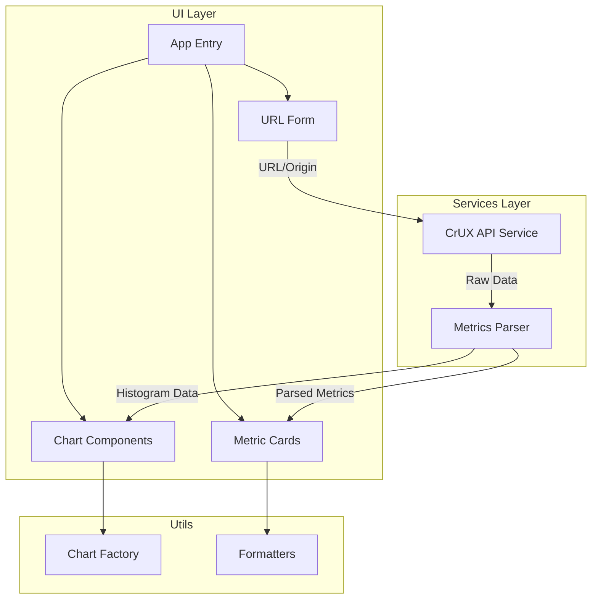

# CrUX API Dashboard - План реализации

## Архитектура проекта



---

## Шаг 1: Очистка шаблона

**Файлы для удаления:**

- `src/counter.ts`
- `src/typescript.svg`
- `public/vite.svg`

**Файлы для полной перезаписи:**

- `src/main.ts` - точка входа
- `src/style.css` - стили дашборда
- `index.html` - базовая разметка

---

## Шаг 2: Установка зависимостей

**Runtime зависимости:**

- `chart.js` - построение графиков (гистограммы)

**Dev зависимости:**

- `prettier` - форматирование кода
- `husky` - git hooks
- `lint-staged` - линтинг staged файлов

**Команда установки:**

```bash
pnpm add chart.js
pnpm add -D prettier husky lint-staged
```

**Почему не axios:** CrUX API отлично работает с нативным `fetch`, а axios добавит лишний вес бандлу. Для одного POST endpoint fetch достаточен.

---

## Шаг 3: Структура файлов

```
src/
├── main.ts                 # Точка входа, инициализация приложения
├── style.css               # Глобальные стили дашборда
├── types/
│   └── crux.ts             # TypeScript типы для CrUX API
├── services/
│   └── crux-api.ts         # Сервис для работы с CrUX API
├── components/
│   ├── url-form.ts         # Форма ввода URL/Origin
│   ├── metric-card.ts      # Карточка метрики (p75 + статус)
│   ├── histogram-chart.ts  # Компонент гистограммы
│   └── form-factors.ts     # Разбивка по устройствам
└── utils/
    ├── formatters.ts       # Форматирование значений метрик
    └── thresholds.ts       # Пороги Good/Needs Improvement/Poor
```

---

## Шаг 4: Инструкция по получению API ключа

**Пользователь должен выполнить:**

1. Перейти в [Google Cloud Console](https://console.cloud.google.com/)
2. Создать новый проект или выбрать существующий
3. Включить **Chrome UX Report API**:
   - APIs and Services -> Library
   - Поиск "Chrome UX Report API" -> Enable

4. Создать API ключ:
   - APIs and Services -> Credentials
   - Create Credentials -> API Key

5. Создать файл `.env` в корне проекта:

```
VITE_CRUX_API_KEY=your_api_key_here
```

**Важно:** Файл `.env` уже должен быть в `.gitignore` (добавим если нет).

---

## Шаг 5: Реализация CrUX API сервиса

Ключевой файл `src/services/crux-api.ts`:

```typescript
const CRUX_API_URL =
  "https://chromeuxreport.googleapis.com/v1/records:queryRecord";

export async function fetchCruxData(
  urlOrOrigin: string,
  formFactor?: "PHONE" | "TABLET" | "DESKTOP",
): Promise<CruxResponse> {
  const apiKey = import.meta.env.VITE_CRUX_API_KEY;
  const isOrigin = !urlOrOrigin.includes("/", urlOrOrigin.indexOf("://") + 3);

  const response = await fetch(`${CRUX_API_URL}?key=${apiKey}`, {
    method: "POST",
    headers: { "Content-Type": "application/json" },
    body: JSON.stringify({
      [isOrigin ? "origin" : "url"]: urlOrOrigin,
      ...(formFactor && { formFactor }),
    }),
  });

  return response.json();
}
```

---

## Шаг 6: Типы CrUX API

Файл `src/types/crux.ts` будет содержать полные типы для:

- `CruxResponse` - структура ответа API
- `Metric` - гистограмма + перцентили
- `Histogram`, `Bin`, `Percentiles`, `Fractions`
- Все имена метрик как union type

---

## Шаг 7: UI компоненты

### URL Form

- Input для ввода URL или origin
- Переключатель типа запроса (URL/Origin)
- Селектор form factor (All/Phone/Tablet/Desktop)
- Кнопка "Анализировать"

### Metric Cards

Для каждой метрики:

- Название метрики (LCP, INP, CLS и т.д.)
- Значение p75 с единицами измерения
- Цветовой индикатор (зелёный/жёлтый/красный)
- Мини-гистограмма распределения

### Histogram Charts

- Chart.js bar charts для каждой метрики
- 3 бина: Good / Needs Improvement / Poor
- Соответствующая цветовая схема

### Form Factors Breakdown

- Pie chart или donut chart
- Показывает распределение: Desktop / Phone / Tablet

---

## Шаг 8: Пороги Core Web Vitals

```typescript
// src/utils/thresholds.ts
export const THRESHOLDS = {
  largest_contentful_paint: { good: 2500, poor: 4000 },
  interaction_to_next_paint: { good: 200, poor: 500 },
  cumulative_layout_shift: { good: 0.1, poor: 0.25 },
  first_contentful_paint: { good: 1800, poor: 3000 },
  experimental_time_to_first_byte: { good: 800, poor: 1800 },
};
```

---

## Шаг 9: Стилизация

Современный минималистичный дизайн:

- CSS Variables для цветов, отступов и размеров
- Grid layout для карточек метрик
- Респонсивный дизайн (mobile-first)
- Цветовая схема Core Web Vitals (зелёный/оранжевый/красный)

---

## Шаг 10: Документация

Файл `README.md`:

- Описание проекта
- Инструкция получения API ключа
- Команды для запуска и сборки
- Скриншоты интерфейса
- Описание архитектуры

---

## Ограничения CrUX API

- **Rate limit**: 150 запросов/минуту (достаточно для дашборда)
- **Данные**: 28-дневный rolling average, обновление ~04:00 UTC
- **Задержка**: Данные отстают на ~2 дня от текущей даты
- **Покрытие**: Только сайты с достаточным трафиком в Chrome

---

## Порядок реализации

Рекомендуемый порядок для последовательной разработки:

1. Очистка шаблона и установка зависимостей
2. Типы CrUX API
3. CrUX API сервис
4. URL форма (без валидации)
5. Базовое отображение данных (JSON)
6. Metric Cards компоненты
7. Histogram Charts
8. Form Factors visualization
9. Стилизация и polish
10. Документация
